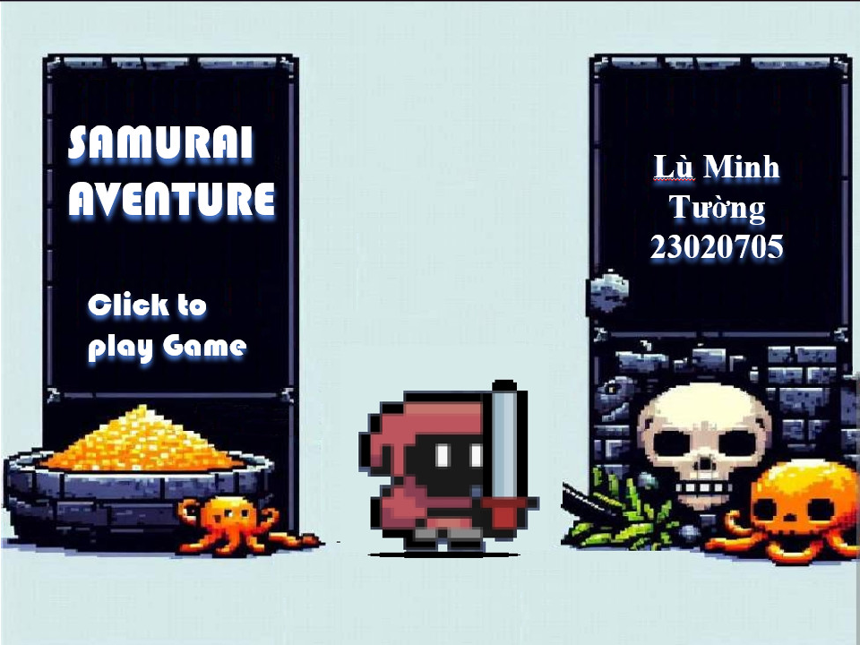

# Samurai Aventure

  Bài tập lớn môn Lập Trình Nâng Cao của Trường Đại học Công Nghệ - Đại Học Quốc Gia Hà Nội

Video trải nghiệm: https://youtu.be/E6C51vkF-bk?si=b6AEPMmaBYV_o1G5
# Giới thiệu game

Samurai Aventure là tựa game thuộc thể loại Roguelike. Chìm đắm vào hành trình khám phá hầm ngục, cố gắng tiêu diệt tất cả kẻ thù và những con Boss khó nhằn. Hãy cùng mình khám phá tựa game này.

- [Thông tin sinh viên](#thông-tin-sinh-viên)
- [Cách tải game](#cách-tải-game)
    * [Cách 1: Không bao gồm code.](#cách-1-không-bao-gồm-code)
    * [Cách 2: Bao gồm code và có thể biên dịch.](#cách-2-bao-gồm-code-và-có-thể-biên-dịch)
- [Bắt đầu game](#bắt-đầu-game)
- [Cách chơi](#cách-chơi)
- [Chiến thắng và thất bại](#chiến-thắng-và-thất-bại)
- [Về đồ họa của game:](#về-đồ-họa-của-game)
- [Về source code game](#về-source-code-game)

# Thông tin sinh viên

  Họ tên : Lù Minh Tường

  Mã SV: 23020705

  Lớp: K68 - J

  Email: 23020705@gmail.com

# Cách tải game

## Cách 1: Không bao gồm code.

Tải game (được nén thành .zip) tại link
sau: https://github.com/mtuong1031/samurai_adventure/blob/master/SamuraiAdventure.zip 
Cách này tiết kiệm bộ nhớ và thời gian tải đi rất nhiều. 
Giải nén game vào một thư mục và bật main.exe lên và chơi. 

## Cách 2: Bao gồm code và có thể biên dịch.

**Bước 1:** Clone repo này về.  
Hoặc Chọn Code -> Download Zip

- Tất cả code đều nằm trong thư mục src. 
- Có thể nhảy đến bước 4 để chơi luôn.

**Bước 2:** Cài mingw. Ở đây tôi cài đặt phiên bản MinGW-W64
GCC-8.1.0 [x86_64-posix-seh](https://sourceforge.net/projects/mingw-w64/files/Toolchains%20targetting%20Win64/Personal%20Builds/mingw-builds/8.1.0/threads-posix/seh/x86_64-8.1.0-release-posix-seh-rt_v6-rev0.7z/download). 

**Bước 3:** Mở cmd trong thư mục chứa Makefile và gõ lệnh mingw32-make.

**Bước 4:** Bật main.exe và chơi

# Bắt đầu game

Chờ một chút rồi click vào bất kì điểm nào trên màn hình để bắt đầu chơi game.

# Cách chơi

  Bạn sẽ bắt đầu cùng nhân vật cơ bản là Samurai Red với các kĩ năng là sử dụng kiếm và khả năng phòng ra lưỡi kiếm ma thuật tấn công từ xa. 

  

  Sử dụng các phím W A S D để di chuyển và hai phím I J để tấn công.

  Trong quá trình chiến đấu, bạn có thể nhận những chiếc rương báu để bổ sung HP.

  Hãy cố gắng sống sót và tiêu diệt Boss của hầm ngục để dành chiến thắng.  

# Chiến thắng và thất bại

- Bạn sẽ chiến thắng nếu tiêu diệt Boss hầm ngục.

- Bạn sẽ thất bại nếu hết HP.

---

# Về đồ họa của game:

  Các tài nguyên đồ họa, hình ảnh trong game được sử dụng từ các nguồn miễn phí trên trang web: [itch.io](https://itch.io/) và được chỉnh sửa thông qua [App Aseprite](https://www.aseprite.org/).

# Một số thuật toán chính

- Hàm kiểm tra va chạm

      bool Collision::AAABB(const SDL_Rect& rect1, const SDL_Rect& rect2)
      {
      if (rect1.x + rect1.w >= rect2.x &&
          rect2.x + rect2.w >= rect1.x &&
          rect1.y + rect1.h >= rect2.y &&
          rect2.y + rect2.h >= rect1.y)
      {
          return true;
      }
      return false;
      }
- Hàm nhận đầu vào (Bàn phím)
    
        if (Game::event.type == SDL_KEYDOWN) 
            {
                switch (Game::event.key.keysym.sym) {
                case SDLK_w:
                    transform->velocity.y = -1;
                    sprite->Play("Run_up");
                    BulletVel = {0, - 1};
                    attack_up = true;
                    Mix_PlayChannel(-1, Game::runSound, 0);
                    break;
                case SDLK_a:
                    transform->velocity.x = -1;
                    sprite->Play("Run");
                    sprite->spriteFlip = SDL_FLIP_HORIZONTAL;
                    flip = SDL_FLIP_HORIZONTAL;
                    BulletVel = {-1, 0};
                    Mix_PlayChannel(-1, Game::runSound, 0);
                    break;
                case SDLK_s:
                    transform->velocity.y = 1;
                    sprite->Play("Run");
                    BulletVel = {0, 1};
                    attack_down = true;
                    Mix_PlayChannel(-1, Game::runSound, 0);
                    break;
                case SDLK_d:
                    transform->velocity.x = 1;
                    sprite->Play("Run");
                    sprite->spriteFlip = SDL_FLIP_NONE;
                    flip = SDL_FLIP_NONE;
                    BulletVel = {1, 0};
                    Mix_PlayChannel(-1, Game::runSound, 0);
                    break;
                case SDLK_ESCAPE:
                    Game::isRunning = false;
                    break;
                default:
                    break;
                }
            }

- Thuật toán để enemy di chuyển về phía nhân vật

      if (Game::playerRect.x > transform->position.x - range
            && Game::playerRect.x < transform->position.x + range
            && Game::playerRect.y > transform->position.y - range
            && Game::playerRect.y < transform->position.y + range) 
      {
          isAttacking = true;
          inRange = true;
          transform->velocity.x = dx * 0.1;
          transform->velocity.y = dy * 0.1;
          if (dx > 0) {
          sprite->spriteFlip = SDL_FLIP_NONE;
        } else {
          sprite->spriteFlip = SDL_FLIP_HORIZONTAL;
        }
          sprite->Play("Run");
      } else {
          transform->velocity.x = 0;
          transform->velocity.y = 0;
          sprite->Play("Idle");
          inRange = false;
          isAttacking = false;
      }

# Về source code game:

  Được tham khảo và phát triển từ Tutorial [How To Make A Game] của Youtuber: [Let's Make Games](https://www.youtube.com/playlist?list=PLhfAbcv9cehhkG7ZQK0nfIGJC_C-wSLrx).

- Folder ECS: Hệ thống ECS và các thành phần liên quan.
    * ECS.cpp và ECS.h: Hệ thống ECS (Entity-Component-System) chia mọi thứ trong game thành 3 khái niệm chính: Entity, Component và System để dễ quản lí và thao tác.
    * Component.h: Khai báo các thư viện trong ECS.
    * SpriteComponent.h: Quản lí các thành phần hình ảnh trong ECS.
    * TransformComponent.h: Quản lí tọa độ, sự thay đổi tọa độ của các thành phần ECS
    * TileComponent.h: Quản lí các đối tượng map.
    * KeyboardContronler.h: Quản lí đầu vào và các thông số, cơ chế nhân vật.
    * ProjectileComponent.h: Quản lí các đối tượng đạn bắn.
    * TheEnemies.h và TheBosses.h: Thiết lập các thông số, logic cơ bản của các đối tượng kẻ thù và boss.
- Folder assets: Chứa tài nguyên về các thành phần của game:
    
- Folder img: Chứa các tài nguyên hình ảnh
- Folder music: Chứa các tài nguyên âm thanh
- AssetManager.cpp và AssetManager.h: Quàn lí các thành phần chính cấu thành nên game
- TextureManager.cpp và TextureManager.h: Quản lí thành phần texture.
- Collision.cpp và Collision.h: Quản lí va chạm.
- Vector2D.cpp và Vector2D.h: Quản lí các vector 2D.
- Map.cpp và Map.h: Quản lí map cũng như kĩ thuật tilemap.
- Game.cpp và Game.h: quản lí các thay đổi, sự kiện của trò chơi.
- game.hpp và game.cpp: hàm main() của trò chơi.
